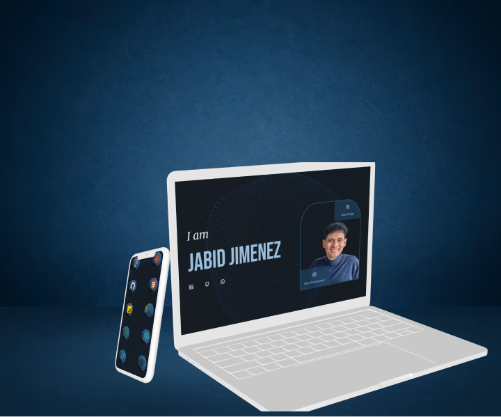

# Portfolio Website



This is my personal portfolio website, showcasing my work. It's built using a blend of Tailwind CSS, shaders, Three.js, and GSAP animations.

## Dependencies

- [Vite](https://vitejs.dev/): The build tool used for the project.
- [Tailwind CSS](https://tailwindcss.com/): A utility-first CSS framework.
- [Three.js](https://threejs.org/): A 3D library for creating WebGL content.
- [GSAP (GreenSock Animation Platform)](https://greensock.com/gsap/): A powerful animation library for JavaScript.

## How to Run

1. Clone this repository to your local machine:

```
git clone https://github.com/your-username/your-portfolio.git
```

3. cd jabid-portfolio-vite

Install dependencies:

```
npm install
```

Start the development server:

```
npm run dev
```

Open your browser and navigate to http://localhost:5173 to view the portfolio website.

## Features

Showcase your work with stunning 3D visuals powered by Three.js.
Smooth animations and transitions using GSAP.
Tailwind CSS for responsive and efficient styling.
Shader magic for captivating effects.
Easy-to-follow codebase for customization.

## Contributions

Feel free to contribute to this project by opening issues or submitting pull requests. Your feedback and enhancements are highly appreciated!

## License

This project is licensed under the MIT License.
